# Corrected Entity Relationship Diagram

```mermaid
erDiagram
  ROLES ||--o{ USERS : assigns
  USERS ||--o{ USER_PROJECTS : has
  PROJECTS ||--o{ USER_PROJECTS : has
  USERS ||--o{ REPORTS : creates
  PROJECTS ||--o{ REPORTS : categorizes
  REPORTS ||--|{ REPORT_VERSIONS : preserves
  PROJECTS ||--o{ REPORT_VERSIONS : snapshots
  REPORT_VERSIONS ||--o{ TASKS : contains
  TASK_TYPES ||--o{ TASKS : classifies
  REPORT_VERSIONS ||--o{ WORK_HOURS : records
  TASK_TYPES ||--o{ WORK_HOURS : groups
  REPORT_VERSIONS ||--o{ BLOCKERS : contains
  REPORT_VERSIONS ||--o{ ACHIEVEMENTS : contains
  REPORT_VERSIONS ||--o{ REPORT_LINKS : contains
  REPORTS ||--o{ REPORT_ACTIONS : reviewed
  REPORT_VERSIONS ||--o{ REPORT_ACTIONS : targets
  USERS ||--o{ REPORT_ACTIONS : performs

  ROLES { int id PK string name UK string description datetime created_at }
  USERS { int id PK int role_id FK string first_name string last_name string email UK string password_hash boolean is_active datetime created_at datetime updated_at }
  PROJECTS { int id PK string name UK string description boolean is_active datetime created_at datetime updated_at }
  USER_PROJECTS { int id PK int user_id FK int project_id FK datetime assigned_at }
  REPORTS { int id PK int user_id FK int project_id FK date week_start date week_end string status string latest_review_comment int current_version datetime submitted_at datetime approved_at datetime created_at datetime updated_at }
  REPORT_VERSIONS { int id PK int report_id FK int project_id FK int version_number date week_start date week_end text next_week_tasks text optional_notes datetime submitted_at datetime created_at }
  TASKS { int id PK int report_version_id FK int task_type_id FK string task_name string priority decimal planned_percentage decimal actual_percentage string status decimal planned_hours decimal actual_hours text deliverable datetime created_at }
  TASK_TYPES { int id PK string name UK string description boolean is_active datetime created_at }
  WORK_HOURS { int id PK int report_version_id FK int task_type_id FK decimal hours datetime created_at }
  BLOCKERS { int id PK int report_version_id FK text description string severity boolean is_key_issue string status datetime created_at }
  ACHIEVEMENTS { int id PK int report_version_id FK text description boolean is_key_achievement datetime created_at }
  REPORT_LINKS { int id PK int report_version_id FK string title string url datetime created_at }
  REPORT_ACTIONS { int id PK int report_id FK int report_version_id FK int reviewer_id FK string action text comment datetime created_at }
```

`REPORT_ACTIONS.report_version_id` is essential: it identifies which immutable submission a manager comment or approval reviewed. Project/week fields remain on each version as a snapshot while `REPORTS` holds current workflow state.
